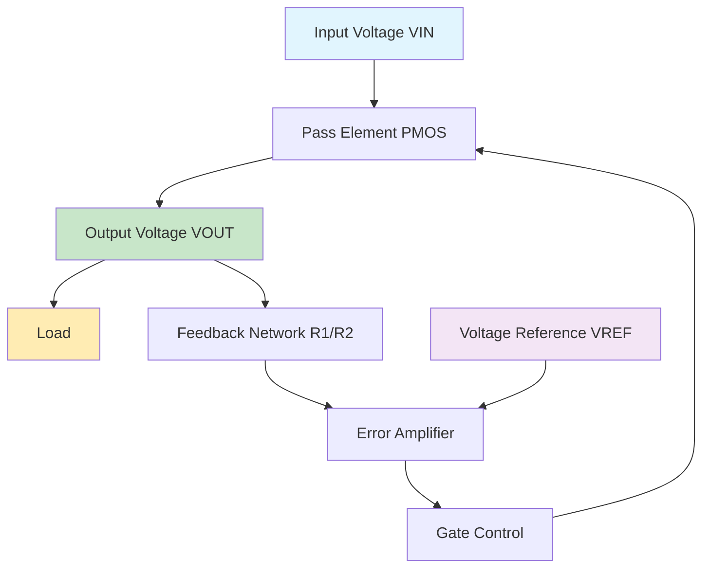
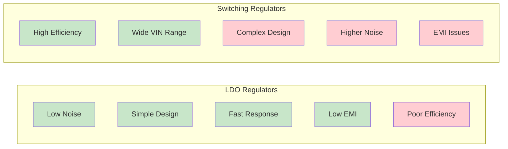
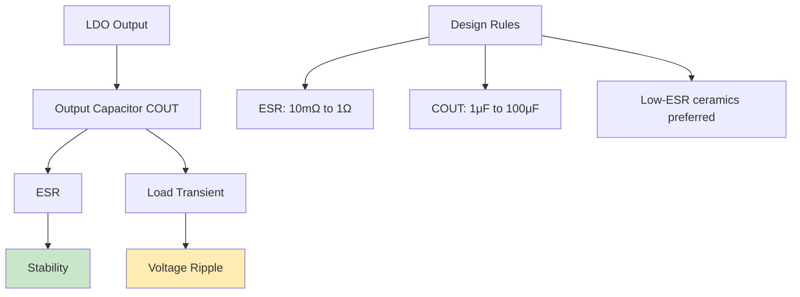
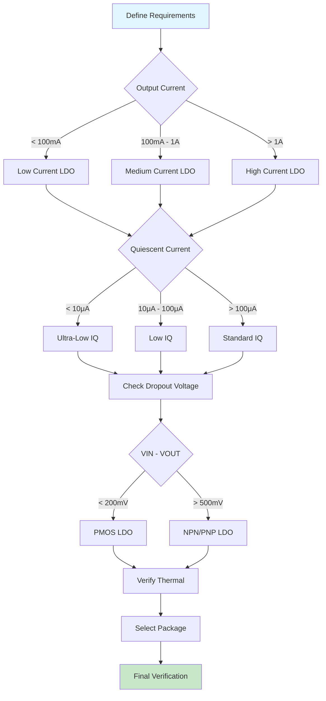

# LDO (Low Dropout) Regulator: A Comprehensive Guide

Low Dropout (LDO) regulators are fundamental components in modern power management systems, providing stable, low-noise voltage regulation with minimal input-output voltage differential. This comprehensive guide explores their operation, design considerations, and practical applications.

## Table of Contents
- [Introduction to LDO Regulators](#introduction)
- [Basic Operation Principles](#operation)
- [Key Specifications](#specifications)
- [LDO vs Switching Regulators](#comparison)
- [Design Considerations](#design)
- [Applications](#applications)
- [Selection Guidelines](#selection)
- [Advanced Topologies](#advanced)
- [Future Trends](#trends)
- [Conclusion](#conclusion)

## Introduction to LDO Regulators {#introduction}

A Low Dropout (LDO) regulator is a linear voltage regulator that can regulate the output voltage even when the supply voltage is very close to the output voltage. The "dropout" refers to the minimum difference between input and output voltages required for proper regulation.

### Key Advantages:
- Low noise output
- Simple implementation
- Fast transient response
- Low electromagnetic interference (EMI)
- Small footprint

### Typical Applications:
- Battery-powered devices
- RF and analog circuits
- Point-of-load regulation
- Post-regulation for switching supplies

## Basic Operation Principles {#operation}

### Circuit Architecture

A basic LDO consists of:
1. **Error Amplifier**: Compares reference voltage with feedback voltage
2. **Pass Element**: Usually a PMOS or NPN transistor that controls current flow
3. **Voltage Reference**: Provides stable reference voltage
4. **Feedback Network**: Sets the output voltage level

### Regulation Mechanism

The LDO maintains constant output voltage through negative feedback:

1. **Reference Comparison**: The error amplifier compares the scaled feedback voltage with the internal reference
2. **Error Correction**: Any deviation generates an error signal
3. **Pass Element Control**: The error signal adjusts the pass element's conductivity
4. **Voltage Restoration**: Output voltage returns to the desired level

### Dropout Voltage

Dropout voltage (VDO) is the minimum input-output voltage difference for regulation:

**VDO = VIN(min) - VOUT**

For PMOS-based LDOs: VDO ≈ RDS(on) × IOUT
For NPN-based LDOs: VDO ≈ VCE(sat) + VBE ≈ 1.2V

## Key Specifications {#specifications}

### 1. Input Voltage Range
- Minimum input voltage: VOUT + VDO
- Maximum input voltage: Limited by power dissipation and junction temperature

### 2. Output Voltage Accuracy
- Initial accuracy: ±1% to ±3%
- Temperature coefficient: ±50ppm/°C to ±100ppm/°C
- Load regulation: 0.1% to 1%
- Line regulation: 0.01%/V to 0.1%/V

### 3. Dropout Voltage
- PMOS LDOs: 50mV to 300mV
- NPN LDOs: 1V to 2V
- PNP LDOs: 200mV to 500mV

### 4. Current Capabilities
- Low current: 50mA to 150mA
- Medium current: 150mA to 1A
- High current: 1A to 7.5A+

### 5. Quiescent Current
- Ultra-low power: <1μA
- Low power: 1μA to 50μA
- Standard: 50μA to 1mA
- High performance: >1mA

### 6. Noise Performance
- Output noise: 10μVRMS to 100μVRMS (10Hz to 100kHz)
- Power Supply Rejection Ratio (PSRR): 40dB to 80dB

### 7. Thermal Characteristics
- Junction temperature range: -40°C to +150°C
- Thermal resistance: Package dependent
- Power dissipation: PD = (VIN - VOUT) × IOUT

## LDO vs Switching Regulators {#comparison}

| Parameter | LDO | Switching |
|-----------|-----|----------|
| Efficiency | 60-90% | 85-95% |
| Complexity | Low | High |
| Noise | Very Low | Higher |
| EMI | Minimal | Significant |
| Size | Small | Larger |
| Cost | Low | Higher |
| Transient Response | Fast | Slower |

## Design Considerations {#design}

### 1. Thermal Management

**Power Dissipation Calculation:**
PD = (VIN - VOUT) × IOUT + VIN × IQ

**Thermal Derating:**
IMAX = (TJ(max) - TA) / (θJA × (VIN - VOUT))

Where:
- TJ(max): Maximum junction temperature
- TA: Ambient temperature
- θJA: Junction-to-ambient thermal resistance

### 2. Stability and Compensation

**Output Capacitor Requirements:**
- ESR range: Critical for stability
- Capacitance: Affects transient response
- Frequency response: Must ensure adequate phase margin

### 3. Input and Output Filtering

**Input Capacitor:**
- Minimum 1μF ceramic capacitor
- Reduces input impedance
- Improves PSRR

**Output Capacitor:**
- Determines stability and transient response
- ESR affects loop compensation
- Ceramic capacitors preferred for low ESR

### 4. PCB Layout Guidelines

- Keep input and output capacitors close to LDO
- Use ground planes for thermal spreading
- Minimize trace resistance in current paths
- Separate analog and digital grounds
- Consider thermal vias for high-power applications

## Applications {#applications}

### 1. Battery-Powered Devices
- Smartphones and tablets
- Wearable electronics
- IoT sensors
- Portable medical devices

### 2. RF and Communication Systems
- Low-noise VCO supplies
- PLL voltage regulation
- ADC/DAC clean power
- RF amplifier biasing

### 3. Automotive Electronics
- Sensor power supplies
- Microcontroller regulation
- Infotainment systems
- Safety system power

### 4. Industrial Applications
- Process control systems
- Measurement equipment
- Motor control circuits
- Instrumentation amplifiers

## Selection Guidelines {#selection}

### Key Selection Criteria:

1. **Output Current**: Maximum load current requirement
2. **Input Voltage Range**: Operating and maximum input voltages
3. **Dropout Voltage**: Critical for battery-powered applications
4. **Quiescent Current**: Important for standby power consumption
5. **Package Type**: Thermal considerations and board space
6. **Additional Features**: Enable/disable, power-good flag, current limiting

## Advanced LDO Topologies {#advanced}

### 1. Multi-Output LDOs
Provide multiple regulated outputs from a single input, reducing component count and board space.

### 2. Adjustable LDOs
Allow output voltage programming through external resistor networks.

### 3. Ultra-Low Noise LDOs
Optimized for noise-sensitive applications with special circuit techniques.

### 4. Fast Transient Response LDOs
Incorporate advanced compensation schemes for rapid load transient recovery.

## Future Trends and Innovations {#trends}

1. **Digital LDOs**: Incorporating digital control loops for improved performance
2. **Adaptive Biasing**: Optimizing quiescent current based on load conditions
3. **Integration**: Combining LDOs with power management ICs
4. **Wide Bandgap Semiconductors**: Enabling higher temperature operation

## Conclusion {#conclusion}

LDO regulators remain indispensable in modern electronic systems, offering an optimal balance between simplicity, performance, and cost. Understanding their operation principles, limitations, and application requirements is crucial for successful power management system design. As technology advances, LDOs continue to evolve with improved efficiency, lower noise, and enhanced integration capabilities, making them even more valuable in emerging applications like IoT, automotive electronics, and high-performance computing systems.

The careful selection and proper implementation of LDO regulators can significantly impact overall system performance, battery life, and reliability. Engineers must consider all aspects of LDO operation, from basic electrical characteristics to advanced thermal and stability considerations, to achieve optimal results in their designs.

---

*This comprehensive guide covers the fundamental aspects of LDO regulators. For specific application requirements or advanced design techniques, consider consulting manufacturer datasheets and application notes for detailed implementation guidance.*
